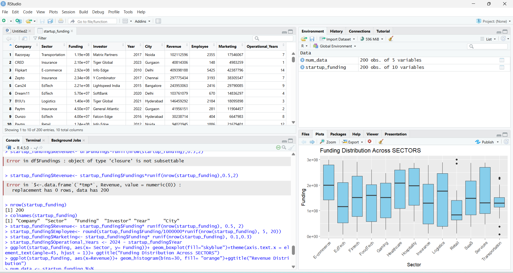
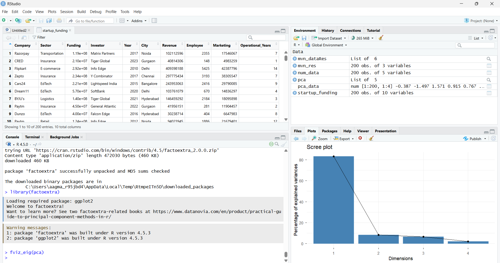
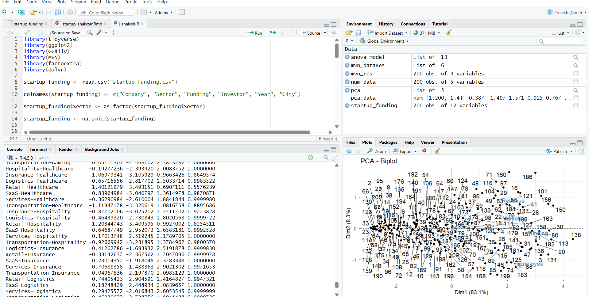

# Startup Success Analyzer

## Overview
This project explores the key factors influencing startup success using statistical analysis in R. It applies multivariate techniques to understand patterns in funding, growth, and operational behavior across different sectors.

## Objective
- Analyze startup data to identify key growth drivers  
- Examine whether startup sectors differ significantly  
- Reduce multiple financial variables into meaningful components  
- Apply statistical testing to validate insights  

## Dataset
The dataset contains information about startups including:
- Company Name  
- Sector  
- Funding Amount  
- Investor  
- Year  
- City  

Additional features were engineered to enhance analysis:
- Revenue  
- Employee Count  
- Marketing Spend  
- Operational Years  

## Methodology

### 1. Data Cleaning
- Renamed columns for consistency  
- Converted categorical variables (Sector → factor)  
- Removed missing values  

---

### 2. Feature Engineering
- Created realistic business metrics using statistical assumptions  
- Revenue, Employees, Marketing Spend derived from Funding  
- Operational Years calculated from founding year  

---

### 3. Exploratory Data Analysis (EDA)
- Boxplots to compare funding across sectors  
- Histograms to study distribution of revenue  
- Correlation matrix to analyze relationships between variables  

---

### 4. Multivariate Normality Test
- Used Mardia’s Test  
- Checked skewness and kurtosis of financial variables  

📌 Result:
- Data shows deviation from perfect normality (common in real-world datasets)

---

### 5. Principal Component Analysis (PCA)
- Reduced multiple correlated variables into principal components  
- Standardized data before applying PCA  

📌 Key Components:
- **PC1 → Company Scale** (Funding, Revenue, Employees)  
- **PC2 → Operational Intensity**  

---

### 6. ANOVA (Analysis of Variance)
- Tested whether Company Scale differs across sectors  

📌 Result:
- No statistically significant difference (p > 0.05)  
- Indicates startup growth is not strongly sector-dependent  

---

## Key Insights
- Startup success is multi-dimensional, not driven by a single factor  
- Sector alone does not significantly impact company scale  
- Financial and operational variables are strongly correlated  
- PCA effectively reduces complexity into meaningful indicators  

##  Tools & Technologies
- R  
- ggplot2  
- dplyr  
- GGally  
- MVN  
- factoextra  

## How to Run
1. Open project in RStudio  
2. Place dataset in the working directory  
3. Run `analysis.R` or knit `startup_success_analyzer.Rmd`  

## Limitations
- Some variables were simulated due to dataset constraints  
- Real-world startup data may show more complexity  
- Multivariate normality assumption is not fully satisfied  

## Future Improvements
- Use real valuation and revenue data  
- Apply regression models for prediction  
- Build interactive dashboards (Shiny / Power BI)  
- Perform clustering for startup segmentation  

